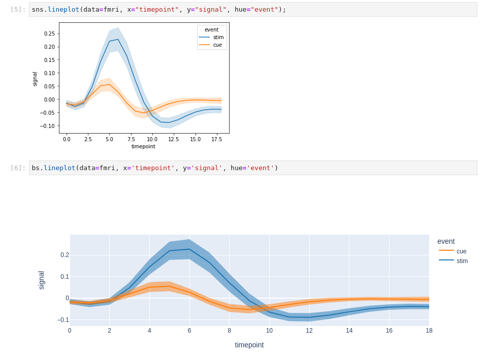

# Bornly

Seaborn-like API for plotly.

## Installation

Note: the `$` is not part of the command:

```console
$ pip install -U bornly
```

## Demo

```python
import bornly as bns

fmri = bns.load_dataset("fmri")
bns.lineplot(data=fmri, x='timepoint', y='signal', hue='event')
```


