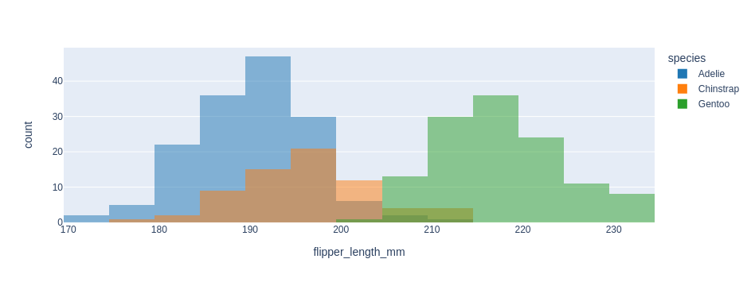

<h1 align="center">
Bornly
</h1>

<p align="center">

</p>

<p align="center">
Seaborn-like API for interactive plotly visualisations
</p>

## Installation

Note: the `$` is not part of the command:

```console
$ pip install -U bornly
```

## Examples

### Lineplot

```python
import bornly as bns

fmri = bns.load_dataset("fmri")
bns.lineplot(data=fmri, x="timepoint", y="signal", hue="event")
```


### Barplot

```python
import bornly as bns

tips = bns.load_dataset("tips")
bns.barplot(x="day", y="total_bill", data=tips, hue="time")
```


### Scatterplot

```python
import bornly as bns

diamonds = bns.load_dataset("diamonds")
bns.scatterplot(
    x="carat",
    y="price",
    hue="clarity",
    size="depth",
    palette="ch:r=-.2,d=.3_r",
    sizes=(1, 8),
    data=diamonds,
)
```


### Kdeplot

```python
import bornly as bns

iris = bns.load_dataset("iris")
bns.kdeplot(data=iris)
```


```python
from string import ascii_letters
import numpy as np
import pandas as pd
import bornly as bns
import matplotlib.pyplot as plt

# Generate a large random dataset
rs = np.random.RandomState(33)
d = pd.DataFrame(data=rs.normal(size=(100, 26)), columns=list(ascii_letters[26:]))
# Compute the correlation matrix
corr = d.corr()
# Generate a mask for the upper triangle
mask = np.triu(np.ones_like(corr, dtype=bool))
# Generate a custom diverging colormap
cmap = bns.diverging_palette(230, 20, as_cmap=True)
# Draw the heatmap with the mask and correct aspect ratio
bns.heatmap(corr, mask=mask, cmap=cmap, vmax=0.3, center=0)
```


### Pairplot

```python
import bornly as bns

penguins = bns.load_dataset("penguins")
bns.pairplot(penguins, hue="species")
```


### Histplot

```python
import bornly as bns

penguins = bns.load_dataset("penguins")
bns.histplot(data=penguins, x="flipper_length_mm", hue="species")
```

